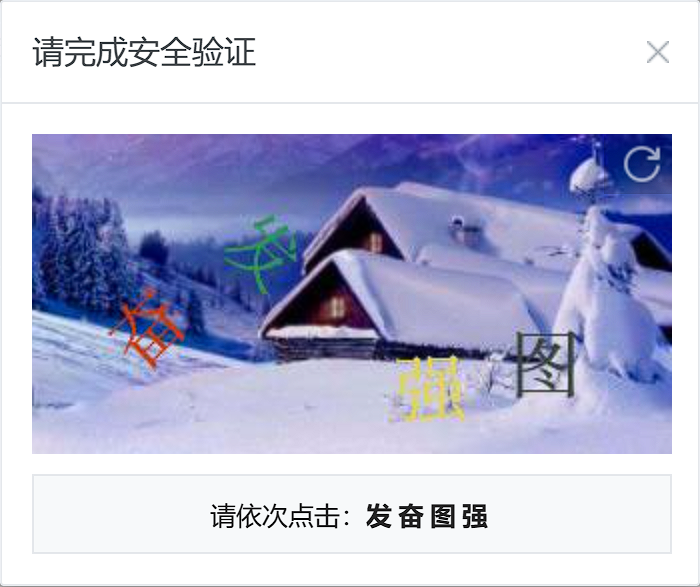

# 复旦大学场馆预约脚本

​	主要使用`Selenium`库实现，难点为文字点选验证码的通过，以及在验证码图片的对应位置进行点选。

​	仅供参考和学习。

## 文字点选验证码的识别

​	截至**2024-07-19**，复旦大学的场馆预约验证码为文字点选验证码，如下图所示。



​	由于文字以随机的位置和旋转角度出现，现有的OCR方案，如`easyocr`，基本都无法识别图中的文字。本项目使用小样本学习的识别方案，使用[MgArcher的Text_select_captcha项目]([MgArcher/Text_select_captcha: 实现文字点选、选字、选择、点触验证码识别，基于pytorch训练 (github.com)](https://github.com/MgArcher/Text_select_captcha))进行识别。本项目参考[MgArcher的Text_select_captcha项目]([MgArcher/Text_select_captcha: 实现文字点选、选字、选择、点触验证码识别，基于pytorch训练 (github.com)](https://github.com/MgArcher/Text_select_captcha))的输入样式，获取页面上的验证码图片和`<b>`标签中的识别目标文本（上图中即`发奋图强`），使用`PIL`库将图片编辑为如下形式。


​	启动[MgArcher的Text_select_captcha项目]([MgArcher/Text_select_captcha: 实现文字点选、选字、选择、点触验证码识别，基于pytorch训练 (github.com)](https://github.com/MgArcher/Text_select_captcha))，通过`http://127.0.0.1:8000/clickOn`获取4个汉字的识别框的左上角点和右下角点坐标（零点位于图片左上角），转换为鼠标点击的坐标，即`[[第1个点击点的x坐标，第1个点击点的y坐标], [...], [...], [...]]`。然后使用`ActionChains`执行以上点击操作。**BUG!** 总是点不在正确的位置上，特别是offset值为负数时，**该问题尚未解决**。

## 使用方法

1. 下载[MgArcher的Text_select_captcha项目]([MgArcher/Text_select_captcha: 实现文字点选、选字、选择、点触验证码识别，基于pytorch训练 (github.com)](https://github.com/MgArcher/Text_select_captcha))并安装其虚拟环境。（截至**2024-07-19**需要将其项目中`apps/utils/res_api.py`中的23、24行

   ```）
           if op:
               router.routes[0].response_model = resource.output_model
   ```

   **注释**掉。）使用`python service.py`启动识别服务器。

2. 使用`python main.py --username 学号 --password 密码 --reservation-arena 预约场馆名 --reservation-date 预约日期YYYY-MM-DD --reservation-time 预约时间段（开始的时间）hh:mm`运行该脚本

